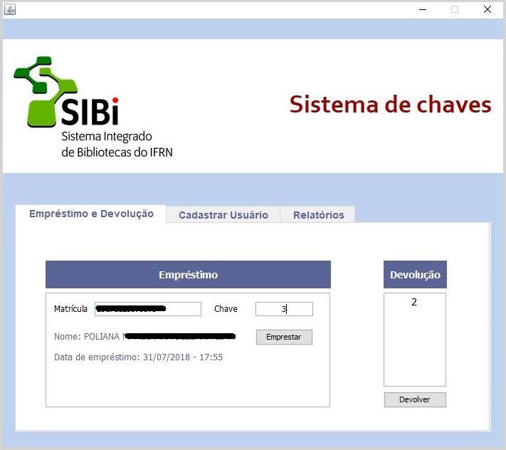
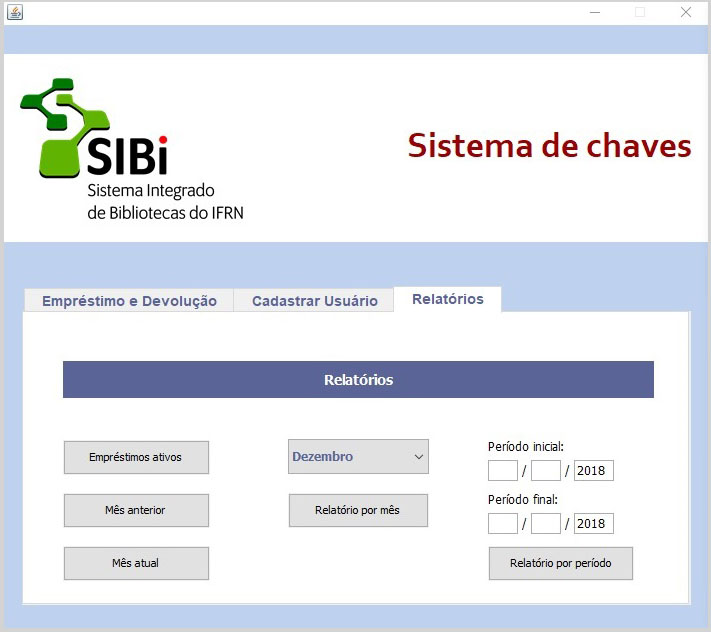
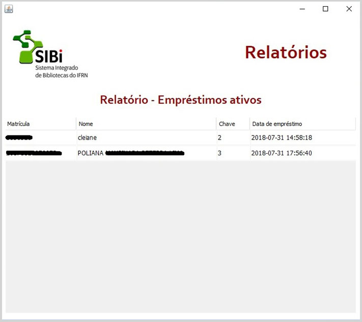

# Chaves - SIBI
Aplicativo desktop desenvolvido para controle de empréstimos de chaves de armários guarda-volume.
O sistema está em produção e em desenvolvimento.

Meu primeiro aplicativo desenvolvido ao iniciar os estudos de java swing.

